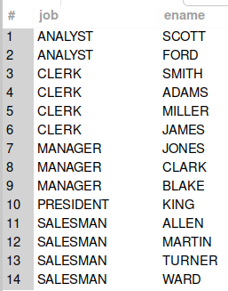
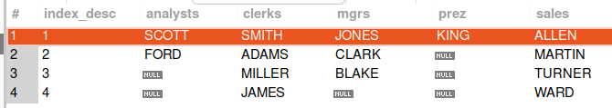

We have this data.

We want to format the output and disply it like this.

In the query, I had to use variables to count rows because I use Mysql 5.6 which doesn't suport the function `ROW_NUMBER OVER` which is available in the other versions of Mysql.
